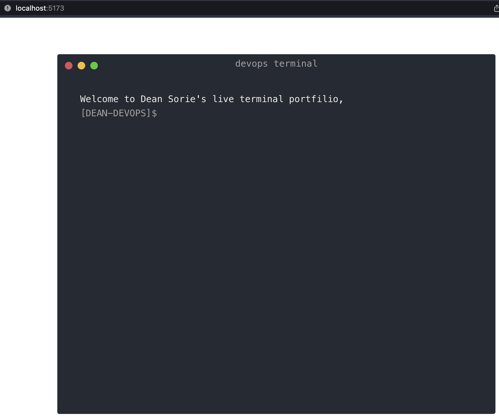

### Building a devops project portfolio

### Tools I'll be using:

##### Frontend:

- React with Vite and TypeScript

##### Backend:

- The app will be containerized with Docker
- Probably will go the serverless route using AWS
- Will try to make a click based CI/CD pipeline which users can build from the frontend
